# Web Application Based on Microservices using the [Spring Boot Framework](https://spring.io/projects/spring-boot)

## Social Media Web App


> Kiire is a comprehensive web application designed around the concept of microservices, offering dual modules: a user-centric social networking platform and an admin-focused monitoring system. Developed using state-of-the-art technologies like [Spring Boot](https://spring.io/projects/spring-boot), [Angular](https://angular.io/), and [TypeScript](https://www.typescriptlang.org/), the application is hosted on a [Kubernetes](https://kubernetes.io/) cluster, providing advantages like seamless scalability and efficient resource management. Users can engage in typical social networking activities such as creating, editing, and reporting posts, while administrators have tools to monitor content and view real-time logs. The system leverages multiple databases like [MySQL](https://dev.mysql.com/doc/), [PostgreSQL](https://www.postgresql.org/docs/), and [Neo4j](https://neo4j.com/developer/kb/) for versatile data storage, and incorporates [RabbitMQ](https://www.rabbitmq.com/documentation.html) for smooth inter-service communication. [Keycloak](https://www.keycloak.org/documentation.html) ensures secure identity management, enhanced by custom plugins.

## Table of Contents

- [Features](#features)
  - [Client](#client)
  - [Admin](#admin)
- [Architecture](#architecture)
- [Getting Started](#getting-started)
  - [Prerequisites](#prerequisites)
  - [Cloning](#cloning)
- [Kubernetes Deployment Guide](#kubernetes-deployment-guide)
  - [Ingress-Nginx](#ingress-nginx)
  - [Kubernetes Dashboard](#kubernetes-dashboard)
  - [Neo4j](#neo4j)
  - [Important Microservices](#important-microservices)
  - [Principal Microservices](#principal-microservices)
  - [Ingress](#ingress)
- [Troubleshooting](#troubleshooting)
- [Documentation](#documentation)
- [License](#license)

---

## Features

### Client

#### Features and Technologies for Client Module

##### Keycloak Login Flow

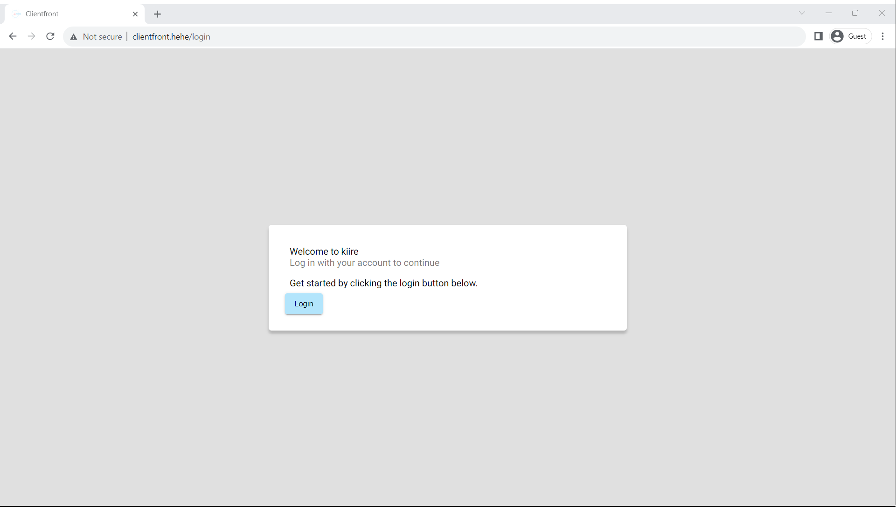
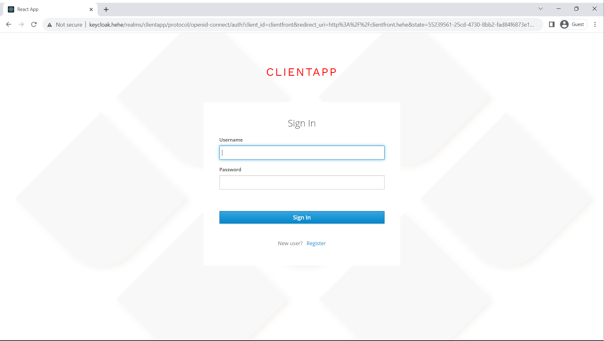
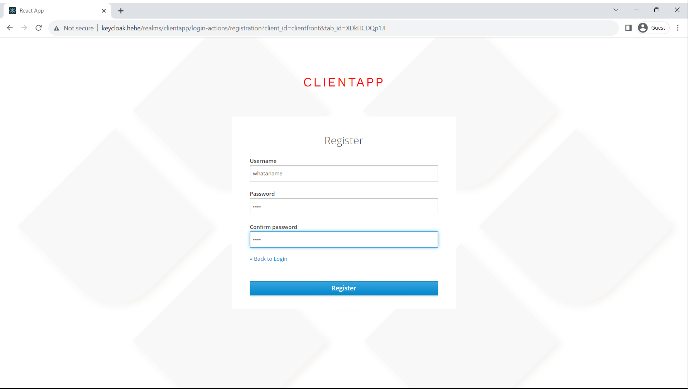
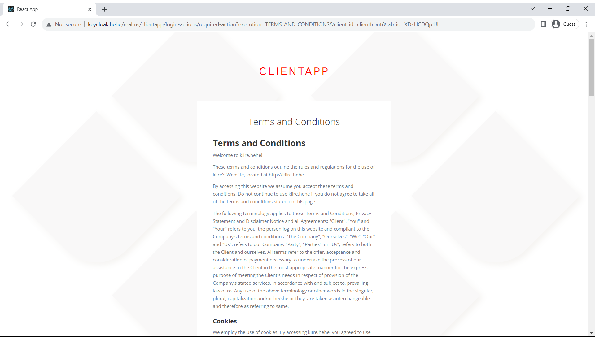

##### Home Page and Menu

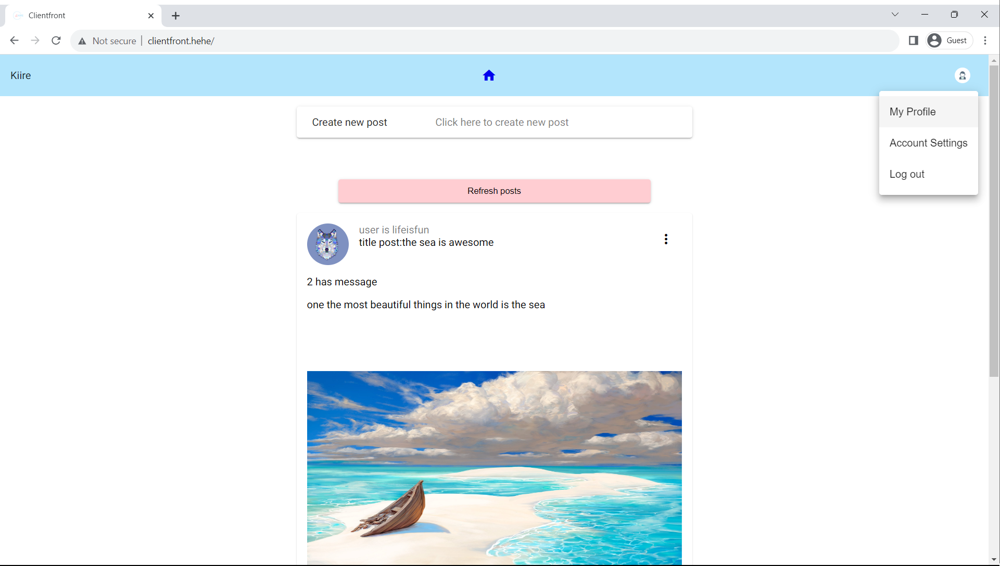

##### Edit Profile Dialog

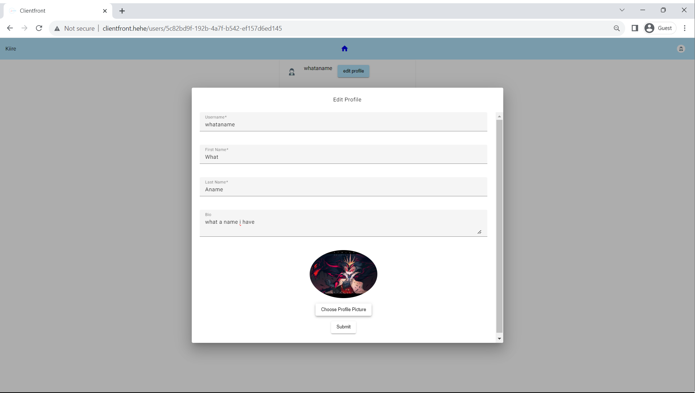

##### Profile Updated and New Post Form

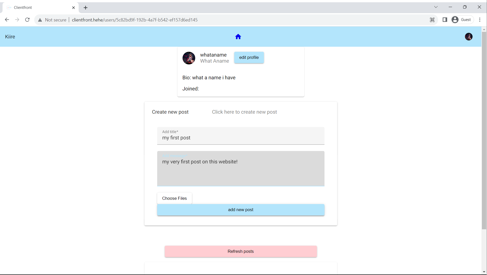

##### New Post Created

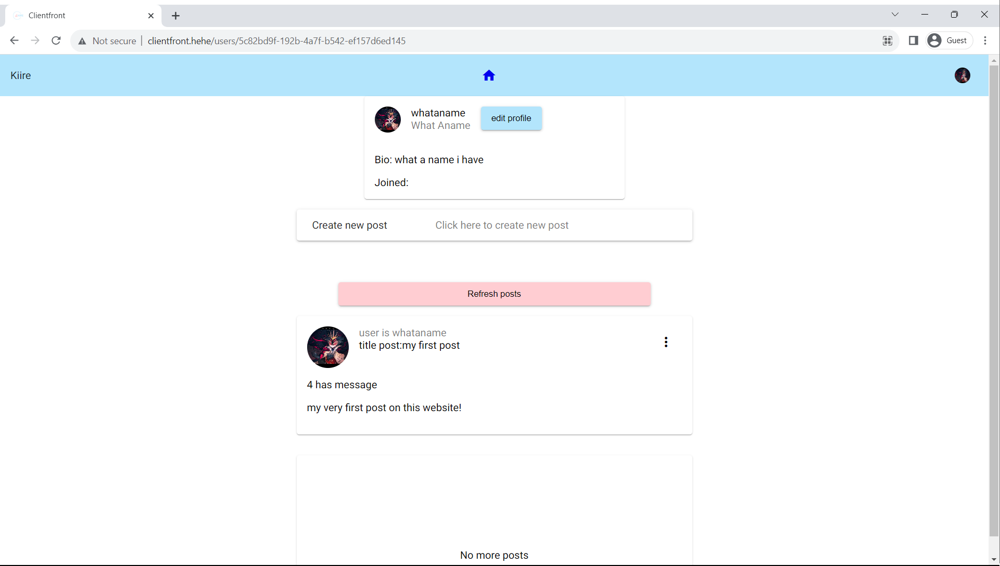

##### Post Menu

*Note: You can edit or delete your own posts.*  
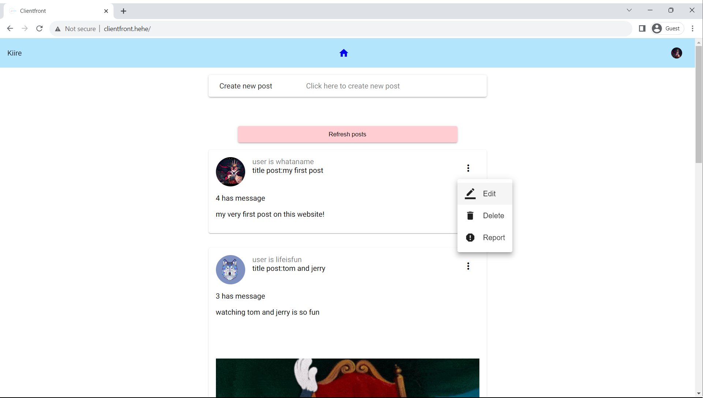

##### Edit Post Dialog

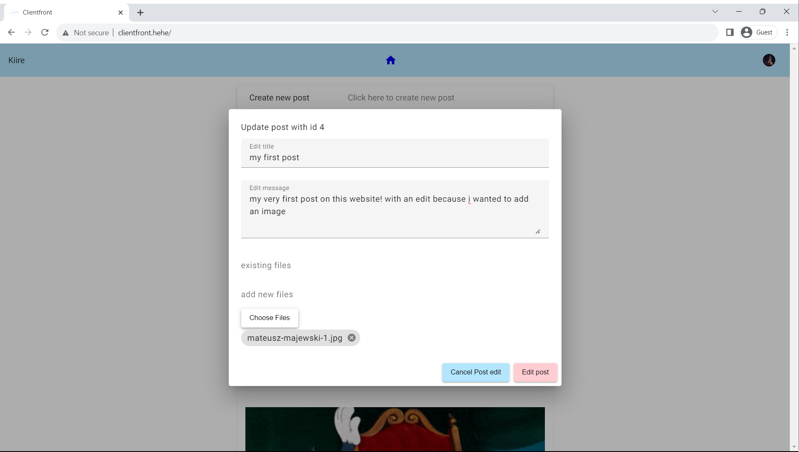

##### User Settings

*Note: Here you can change your password.*  
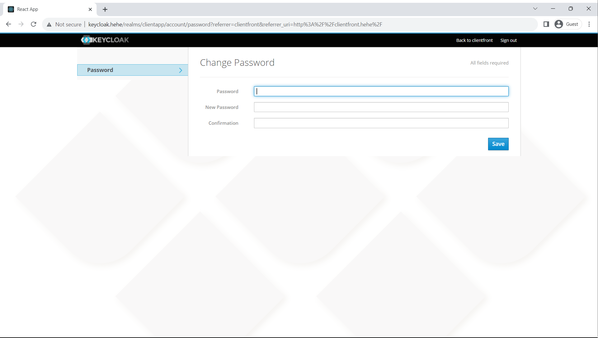

---

### Admin

#### Features and Technologies for Admin Module

##### Keycloak Login Flow Admin

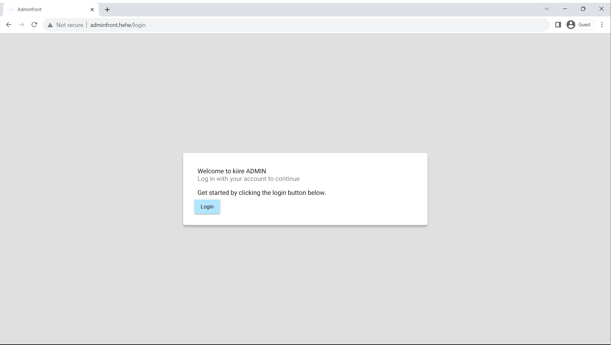


##### Admin Home Page

*Note: Here, reports are processed. Posts that violate rules are deleted.*  
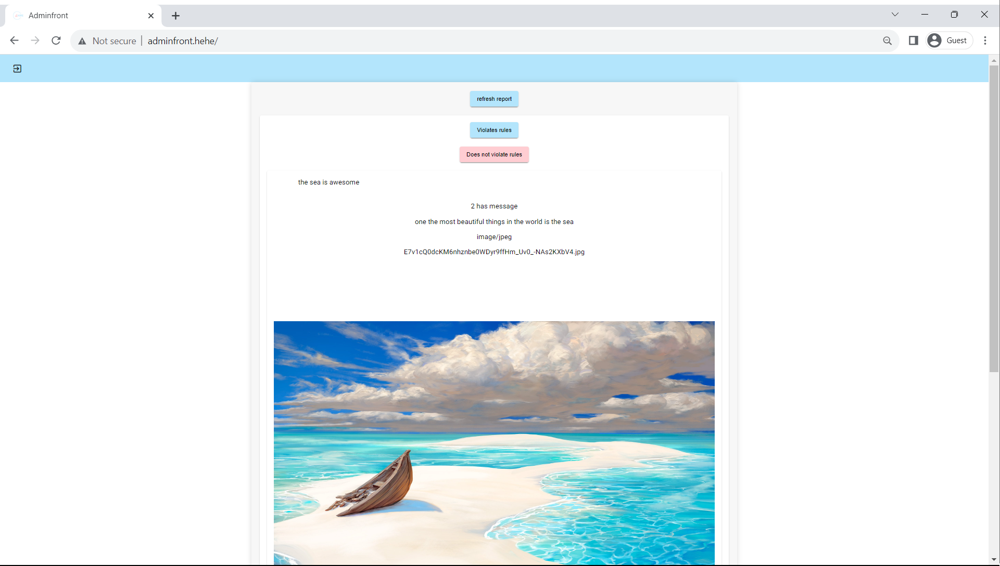

##### Real-Time Display of Client Events

*Note: Visible on the home page.*  
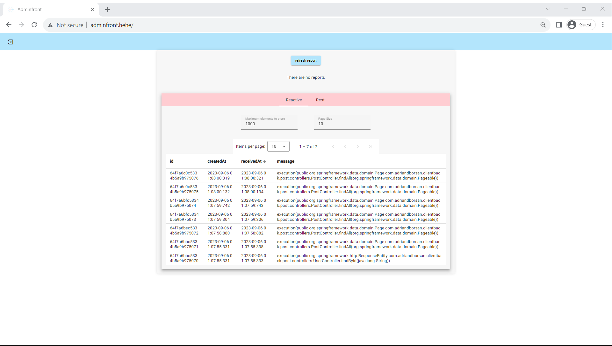

##### Data View via REST API

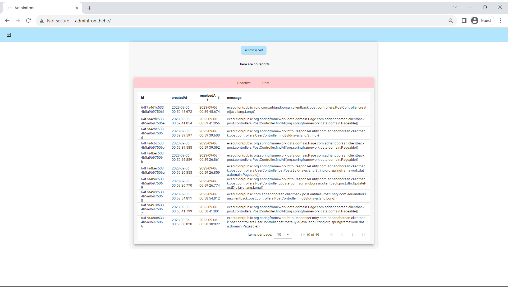

---

## Architecture

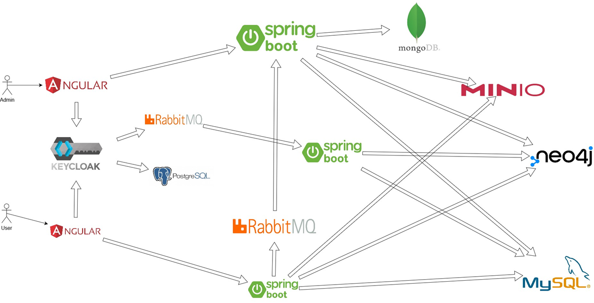

This architecture constitutes a two-tier application: a client-side and an admin-side, each having a corresponding Angular frontend and Spring Boot backend—denoted as `[client|admin]front` and `[client|admin]back`, respectively. Both frontends are secured using Keycloak, which communicates with a PostgreSQL database and a RabbitMQ instance.

For data storage, three databases are utilized: MySQL for structured data, Neo4j for relationships between entities, and Minio for file storage. The architecture incorporates several other utility services like Adminer, Kubernetes Dashboard, Ingress, and more. These additional services are configured in the `k8sconfig` directory.

### Projects with Independent Repositories

- [adminback](https://github.com/adriandborsan/bachelor-thesis/tree/adminback): Spring Boot backend for the admin interface
- [adminfront](https://github.com/adriandborsan/bachelor-thesis/tree/adminfront): Angular frontend for the admin interface
- [authlistener](https://github.com/adriandborsan/bachelor-thesis/tree/authlistener): Spring Boot service for listening to Keycloak events and synchronizing databases
- [clientback](https://github.com/adriandborsan/bachelor-thesis/tree/clientback): Spring Boot backend for the client interface
- [clientfront](https://github.com/adriandborsan/bachelor-thesis/tree/clientfront): Angular frontend for the client interface
- [keycloakify](https://github.com/adriandborsan/bachelor-thesis/tree/keycloakify): React-based customization of the Keycloak interface

### Kubernetes-Only Configurations

- [k8sconfig](https://github.com/adriandborsan/bachelor-thesis/tree/k8sconfig): Houses Kubernetes configurations for services that don't require a dedicated repository.

### Development Approach

Each project lives in an independent orphan branch, allowing for isolated development while retaining the benefits of a single repository. This setup facilitates easy migration to separate repositories in the future. When code is ready for merging into the `dev` or `main` branches, it's moved to a subfolder named after the corresponding microservice.

---

## Getting Started

### Prerequisites

- [Kubernetes](https://kubernetes.io/docs/home/)
- [kubectl](https://kubernetes.io/docs/reference/kubectl/overview/)
- [Skaffold](https://skaffold.dev/docs/install/)
- [Helm](https://helm.sh/docs/intro/install/)
- [npm](https://docs.npmjs.com/downloading-and-installing-node-js-and-npm)
- [Java](https://docs.oracle.com/en/java/javase/index.html)

### Cloning

This command allows cloning of the entire repository projects to facilitate easier working on different projects at the same time. It should be run in a bash terminal:

```bash
git clone --single-branch --branch k8sconfig git@github.com:adriandborsan/bachelor-thesis.git k8sconfig && \
git clone --single-branch --branch clientback git@github.com:adriandborsan/bachelor-thesis.git clientback && \
git clone --single-branch --branch clientfront git@github.com:adriandborsan/bachelor-thesis.git clientfront && \
git clone --single-branch --branch adminback git@github.com:adriandborsan/bachelor-thesis.git adminback && \
git clone --single-branch --branch adminfront git@github.com:adriandborsan/bachelor-thesis.git adminfront && \
git clone --single-branch --branch authlistener git@github.com:adriandborsan/bachelor-thesis.git authlistener && \
git clone --single-branch --branch keycloakify git@github.com:adriandborsan/bachelor-thesis.git keycloakify

```

---

## Kubernetes Deployment Guide

### Deployment Order Explanation

Before proceeding with the Kubernetes deployment, it's crucial to follow the steps in the specified sequence to ensure the smooth functioning of the system.

1. **Ingress-Nginx**: The Ingress-Nginx needs to be installed first to handle external access to the services within the Kubernetes cluster.
2. **Neo4j**: The Neo4j database should be deployed next. This sets up your graph database for use by the rest of the services.
3. **K8sconfig Skaffold**: It is important to run Skaffold in the `./k8sconfig` directory before running the Skaffold for the principal microservices. This sets up important microservices that the principal ones depend on.
4. **Principal Microservices**: Once all the dependencies are up, you can deploy the main microservices using Skaffold in the root directory.
5. **Ingress Configuration**: Finally, apply the `ingress.yaml` file to enable Ingress to route traffic to the deployed microservices. It's essential to perform this step last to ensure that all services routed by the ingress are up and running.

### Ingress-Nginx

```bash
helm repo add ingress-nginx https://kubernetes.github.io/ingress-nginx && \
helm repo update && \
helm upgrade --install ingress-nginx ingress-nginx/ingress-nginx --create-namespace --namespace ingress-nginx
```

for testing on windows it is also necessary to append these entries to `C:\Windows\System32\drivers\etc\hosts`

```txt
127.0.0.1 clientfront.hehe
127.0.0.1 keycloak.hehe
127.0.0.1 adminfront.hehe
127.0.0.1 minio.hehe
127.0.0.1 dashboard.hehe
```

### Kubernetes Dashboard

Run the following command inside the `./k8sconfig/dashboard` directory.

```bash
helm repo add kubernetes-dashboard https://kubernetes.github.io/dashboard/ && \
helm repo update && \
helm upgrade --install kubernetes-dashboard kubernetes-dashboard/kubernetes-dashboard --create-namespace --namespace kubernetes-dashboard && \
kubectl apply -f dashboard-combined.yaml && \
kubectl get secret admin-user -n kubernetes-dashboard -o jsonpath={".data.token"} | base64 -d
```

### Neo4j

Run the following command inside the `./k8sconfig/neo4j` directory.

```bash
helm repo add neo4j https://helm.neo4j.com/neo4j && \
helm repo update && \
skaffold run
```

### Important Microservices

Run the following command inside the `./k8sconfig` directory.

```bash
skaffold run
```

### Principal Microservices

Run the following command inside the root directory.

```bash
skaffold run
```

### Ingress

Run the following command inside the root directory.

```bash
kubectl apply -k k8sconfig/ingress && \
kubectl apply -f k8sconfig/ingress/ingress.yaml
```

---

## Troubleshooting

- **Windows End of Line Issue**: Ensure bash scripts have LF line endings which can be changed from a text editor such as Visual Studio Code.
- **Persistent Volume and Interdependencies**: Rerun `skaffold run` for the specific service and make sure the service that is dependent on was already deployed.

---

## Documentation

For a detailed explanation and an in-depth look at the thesis, the thesis paper and PowerPoint presentation are available in PDF format.

- [Thesis Paper PDF](./resources/thesis.pdf)
- [Presentation PDF](./resources/presentation.pdf)

---

## License

This project is licensed under the GNU GENERAL PUBLIC LICENSE Version 3. See the [LICENSE](./LICENSE) file for more details.
