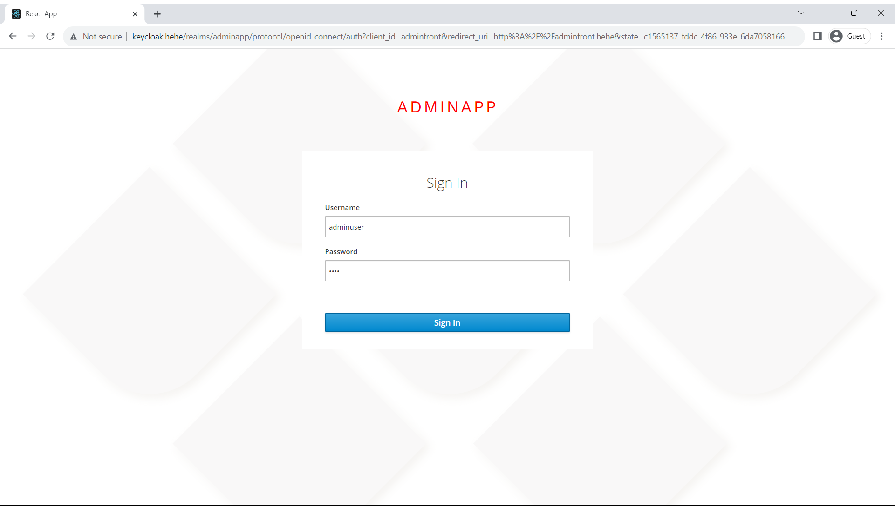

# Web Application Based on Microservices using the Spring Boot Framework

## Social Media Web App


> Kiire is a comprehensive web application designed around the concept of microservices, offering dual modules: a user-centric social networking platform and an admin-focused monitoring system. Developed using state-of-the-art technologies like Spring Boot, Angular, and TypeScript, the application is hosted on a Kubernetes cluster, providing advantages like seamless scalability and efficient resource management. Users can engage in typical social networking activities such as creating, editing, and reporting posts, while administrators have tools to monitor content and view real-time logs. The system leverages multiple databases like MySQL, PostgreSQL, and Neo4j for versatile data storage, and incorporates RabbitMQ for smooth inter-service communication. Keycloak ensures secure identity management, enhanced by custom plugins.

## Table of Contents

- [Web Application Based on Microservices using the Spring Boot Framework]
  - [Table of Contents](#table-of-contents)
  - [Features](#features)
    - [Client](#client)
    - [Admin](#admin)
  - [Architecture](#architecture)
  - [Getting Started](#getting-started)
    - [Prerequisites](#prerequisites)
    - [Cloning](#cloning)
  - [Kubernetes Deployment Guide](#kubernetes-deployment-guide)
    - [Ingress-Nginx](#ingress-nginx)
    - [Kubernetes Dashboard](#kubernetes-dashboard)
    - [Neo4j](#neo4j)
    - [Important Microservices](#important-microservices)
    - [Principal Microservices](#principal-microservices)
    - [Ingress](#ingress)
  - [Troubleshooting](#troubleshooting)
  - [Branches and Configurations](#branches-and-configurations)
  - [Documentation](#documentation)
  - [License](#license)

---

## Features

### Client

#### Client Features and Technologies

- *Keycloak login flow*  


- *Home page and menu*  


- *Edit Profile Dialog*  


- *Profile Updated And New Post Form*  


- *New Post Created*  


- *Post Menu. Own posts can also be edited or deleted*  


- *Edit Post Dialog*  


- *User Settings Where The Password Can Be Changed*  


### Admin

#### Admin Features and Technologies

- *Keycloak login Flow*  



- *Admin Home Page Hwere Reports are treated and if a post is considered to violate rules, then it gets deleted*  


- *also in the home page the admin can see Real Time Display of Events Happening in Client App*  


- *Seeing The Data Through the Rest Api*  


---

## Architecture


---

## Getting Started

### Prerequisites

- [Kubernetes](https://kubernetes.io/docs/home/)
- [kubectl](https://kubernetes.io/docs/reference/kubectl/overview/)
- [Skaffold](https://skaffold.dev/docs/install/)
- [Helm](https://helm.sh/docs/intro/install/)
- [npm](https://docs.npmjs.com/downloading-and-installing-node-js-and-npm)
- [Java](https://docs.oracle.com/en/java/javase/index.html)

### Cloning

```bash
git clone --single-branch --branch main git@github.com:adriandborsan/bachelor-thesis.git main && \
git clone --single-branch --branch k8sconfig git@github.com:adriandborsan/bachelor-thesis.git k8sconfig && \
git clone --single-branch --branch clientback git@github.com:adriandborsan/bachelor-thesis.git clientback && \
git clone --single-branch --branch clientfront git@github.com:adriandborsan/bachelor-thesis.git clientfront && \
git clone --single-branch --branch adminback git@github.com:adriandborsan/bachelor-thesis.git adminback && \
git clone --single-branch --branch adminfront git@github.com:adriandborsan/bachelor-thesis.git adminfront && \
git clone --single-branch --branch authlistener git@github.com:adriandborsan/bachelor-thesis.git authlistener && \
git clone --single-branch --branch keycloakify git@github.com:adriandborsan/bachelor-thesis.git keycloakify

```

---

## Kubernetes Deployment Guide

### Deployment Order Explanation

Before proceeding with the Kubernetes deployment, it's crucial to follow the steps in the specified sequence to ensure the smooth functioning of the system.

1. **Ingress-Nginx**: The Ingress-Nginx needs to be installed first to handle external access to the services within the Kubernetes cluster.
2. **Neo4j**: The Neo4j database should be deployed next. This sets up your graph database for use by the rest of the services.
3. **K8sconfig Skaffold**: It is important to run Skaffold in the `./k8sconfig` directory before running the Skaffold for the principal microservices. This sets up important microservices that the principal ones depend on.
4. **Principal Microservices**: Once all the dependencies are up, you can deploy the main microservices using Skaffold in the root directory.
5. **Ingress Configuration**: Finally, apply the `ingress.yaml` file to enable Ingress to route traffic to the deployed microservices. It's essential to do this last to make sure that all the services to which the ingress routes traffic are up and running.

### Ingress-Nginx

```bash
helm repo add ingress-nginx https://kubernetes.github.io/ingress-nginx && \
helm repo update && \
helm upgrade --install ingress-nginx ingress-nginx/ingress-nginx --create-namespace --namespace ingress-nginx
```

on windows it is also necessary to append these entries to `C:\Windows\System32\drivers\etc\hosts`

```txt
127.0.0.1 clientfront.hehe
127.0.0.1 keycloak.hehe
127.0.0.1 adminfront.hehe
127.0.0.1 minio.hehe
127.0.0.1 dashboard.hehe
```

### Kubernetes Dashboard

Run the following commands inside the `./k8sconfig/dashboard` directory.

```bash
helm repo add kubernetes-dashboard https://kubernetes.github.io/dashboard/ && \
helm repo update && \
helm upgrade --install kubernetes-dashboard kubernetes-dashboard/kubernetes-dashboard --create-namespace --namespace kubernetes-dashboard && \
kubectl apply -f dashboard-combined.yaml
```

### Neo4j

Run the following commands inside the `./k8sconfig/neo4j` directory.

```bash
helm repo add neo4j https://helm.neo4j.com/neo4j && \
helm repo update && \
skaffold run
```

### Important Microservices

Run the following command inside the `./k8sconfig` directory.

```bash
skaffold run
```

### Principal Microservices

Run the following command inside the root directory.

```bash
skaffold run
```

### Ingress

Run the following commands inside the root directory.

```bash
kubectl apply -k k8sconfig/ingress
```

```bash
kubectl apply -f k8sconfig/ingress/ingress.yaml
```

---

## Troubleshooting

- **Windows End of Line Issue**: Ensure bash scripts have LF line endings.
- **Persistent Volume and Interdependencies**: Rerun `skaffold run` for the specific service and make sure the service that is dependent on was already deployed.

---

## Branches and Configurations

- [adminback](https://github.com/adriandborsan/bachelor-thesis/tree/adminback)
- [adminfront](https://github.com/adriandborsan/bachelor-thesis/tree/adminfront)
- [authlistener](https://github.com/adriandborsan/bachelor-thesis/tree/authlistener)
- [clientback](https://github.com/adriandborsan/bachelor-thesis/tree/clientback)
- [clientfront](https://github.com/adriandborsan/bachelor-thesis/tree/clientfront)
- [k8sconfig](https://github.com/adriandborsan/bachelor-thesis/tree/k8sconfig)
- [keycloakify](https://github.com/adriandborsan/bachelor-thesis/tree/keycloakify)

---

## Documentation

- [Thesis Paper PDF](./resources/thesis.pdf)
- [Presentation PDF](./resources/presentation.pdf)

---

## License

This project is licensed under the GNU GENERAL PUBLIC LICENSE Version 3. See the [LICENSE](./LICENSE) file for more details.
